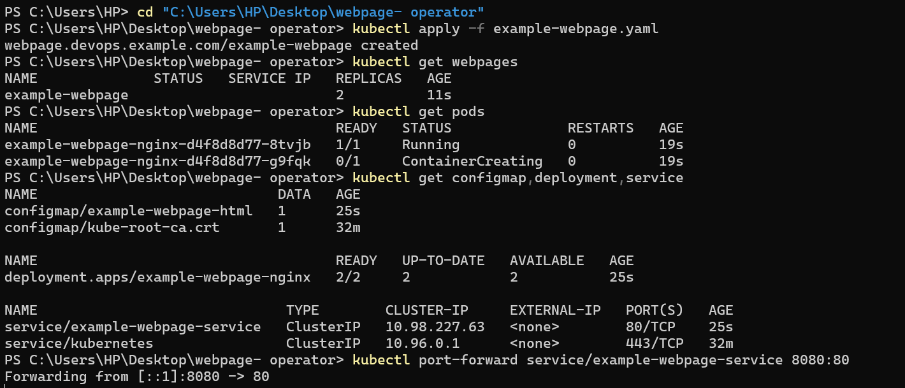
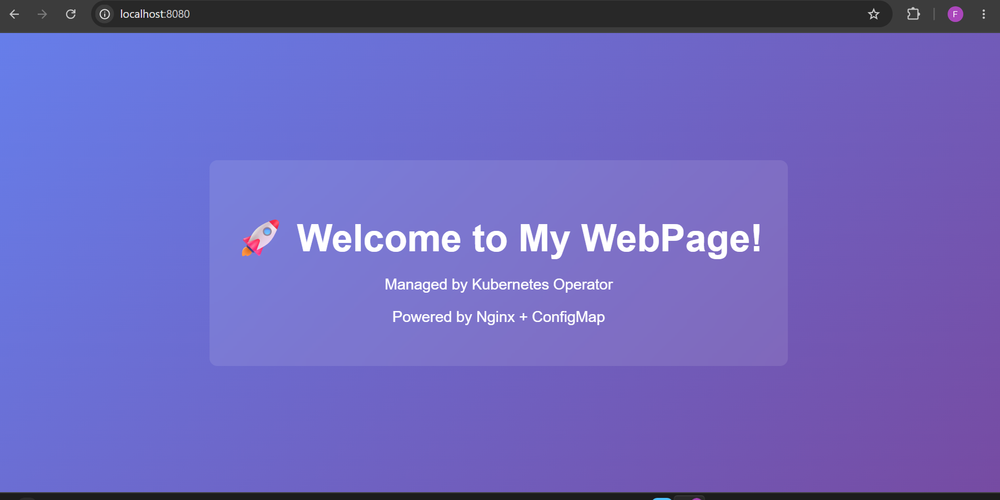
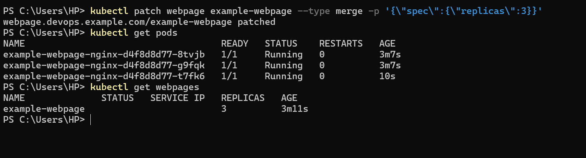
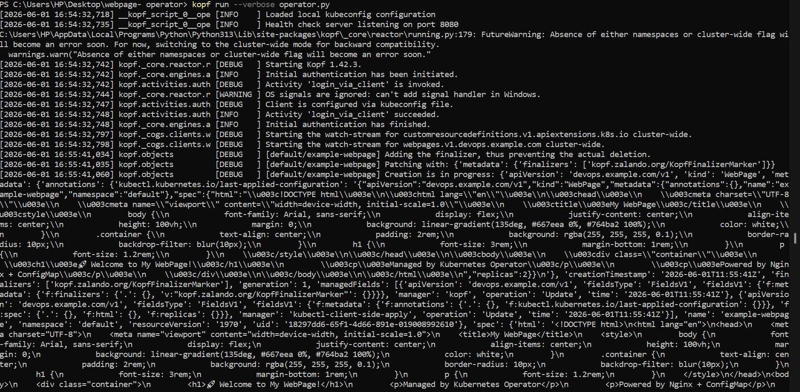

# WebPage Kubernetes Operator

A production-ready Kubernetes Operator built with Python and Kopf that manages custom `WebPage` resources. This operator automatically creates and manages ConfigMaps, Nginx Deployments, and Services to serve static HTML content.

## 🎯 Features

- **Declarative Management**: Define your web pages as Kubernetes custom resources
- **Automatic Reconciliation**: Operator ensures actual state matches desired state
- **Dynamic Scaling**: Adjust replica count on-the-fly
- **Content Updates**: Update HTML content without manual intervention
- **Production Ready**: Includes RBAC, resource limits, health checks, and error handling

## 📁 Project Structure

```
webpage-operator/
├── operator.py              # Main operator logic with Kopf handlers
├── requirements.txt         # Python dependencies
├── Dockerfile              # Container image definition
├── crd.yaml                # CustomResourceDefinition for WebPage
├── rbac.yaml               # RBAC permissions (ServiceAccount, ClusterRole, etc.)
├── deploy.yaml             # Deployment manifest for the operator
├── example-webpage.yaml    # Example WebPage resource
└── README.md              # This file
```
## Demo

**All resources provisioned automatically from a single YAML:**



**HTML content served live via Nginx + ConfigMap:**



**Scaling from 2 → 3 replicas with a single patch command:**



**Operator reconciliation logs:**



## 🚀 Quick Start

### Prerequisites

- Kubernetes cluster (v1.20+)
- kubectl configured
- Docker (for building the operator image)
- Python 3.10+ (for local development)

### Installation

1. **Install the CRD**
   ```bash
   kubectl apply -f crd.yaml
   ```

2. **Set up RBAC**
   ```bash
   kubectl apply -f rbac.yaml
   ```

3. **Build and push the operator image**
   ```bash
   docker build -t your-registry/webpage-operator:latest .
   docker push your-registry/webpage-operator:latest
   ```

4. **Update deploy.yaml** with your image registry
   ```yaml
   # In deploy.yaml, update:
   image: your-registry/webpage-operator:latest
   ```

5. **Deploy the operator**
   ```bash
   kubectl apply -f deploy.yaml
   ```

6. **Verify the operator is running**
   ```bash
   kubectl get pods -l app=webpage-operator
   kubectl logs -l app=webpage-operator -f
   ```

### Creating Your First WebPage

1. **Apply the example WebPage**
   ```bash
   kubectl apply -f example-webpage.yaml
   ```

2. **Check the status**
   ```bash
   kubectl get webpages
   kubectl describe webpage example-webpage
   ```

3. **View created resources**
   ```bash
   # ConfigMap with HTML content
   kubectl get configmap example-webpage-html
   
   # Nginx Deployment
   kubectl get deployment example-webpage-nginx
   
   # Service
   kubectl get service example-webpage-service
   ```

4. **Access the web page**
   ```bash
   # Get the service IP
   kubectl get webpage example-webpage -o jsonpath='{.status.serviceIP}'
   
   # Port-forward to access locally
   kubectl port-forward service/example-webpage-service 8080:80
   
   # Visit http://localhost:8080
   ```

## 📝 Usage Examples

### Basic WebPage

```yaml
apiVersion: devops.example.com/v1
kind: WebPage
metadata:
  name: hello-world
spec:
  html: "<h1>Hello, Kubernetes!</h1>"
  replicas: 1
```

### Multi-replica WebPage

```yaml
apiVersion: devops.example.com/v1
kind: WebPage
metadata:
  name: high-availability-page
spec:
  html: |
    <!DOCTYPE html>
    <html>
    <head><title>HA Page</title></head>
    <body>
      <h1>High Availability Page</h1>
      <p>Served by multiple replicas</p>
    </body>
    </html>
  replicas: 3
```

### Updating Content

```bash
# Edit the WebPage resource
kubectl edit webpage hello-world

# Or patch it
kubectl patch webpage hello-world --type merge -p '{"spec":{"html":"<h1>Updated Content!</h1>"}}'
```

### Scaling

```bash
kubectl patch webpage hello-world --type merge -p '{"spec":{"replicas":5}}'
```

## 🔧 Development

### Local Testing (without cluster deployment)

1. **Install dependencies**
   ```bash
   pip install -r requirements.txt
   ```

2. **Install the CRD in your cluster**
   ```bash
   kubectl apply -f crd.yaml
   kubectl apply -f rbac.yaml
   ```

3. **Run the operator locally**
   ```bash
   kopf run operator.py --verbose
   ```

4. **In another terminal, create a WebPage**
   ```bash
   kubectl apply -f example-webpage.yaml
   ```

### Running Tests

```bash
# Watch operator logs
kubectl logs -l app=webpage-operator -f

# Check operator events
kubectl get events --sort-by='.lastTimestamp'

# Describe a WebPage for troubleshooting
kubectl describe webpage <name>
```

## 🏗️ Architecture

### Reconciliation Loop

The operator follows the standard Kubernetes reconciliation pattern:

1. **User Action**: User creates/updates a WebPage resource
2. **Event Detection**: Kopf detects the change via Kubernetes API watch
3. **Handler Execution**: Appropriate handler (`@kopf.on.create` or `@kopf.on.update`) is triggered
4. **Resource Creation/Update**:
   - ConfigMap is created/updated with HTML content
   - Nginx Deployment is created/updated with specified replicas
   - Service is created to expose the deployment
5. **Status Update**: WebPage status is updated with service IP and readiness state
6. **Continuous Monitoring**: Operator continues to watch for changes

### Resource Ownership

The operator sets `ownerReferences` on all created resources (ConfigMap, Deployment, Service). This ensures:
- Automatic garbage collection when a WebPage is deleted
- Clear resource hierarchy and ownership
- Proper lifecycle management

## 🔒 Security

- **Non-root execution**: Operator runs as user 1000
- **RBAC**: Minimal required permissions via ClusterRole
- **Resource limits**: CPU and memory limits defined
- **Read-only root filesystem**: Enhanced container security
- **ServiceAccount**: Dedicated identity for the operator

## 📊 Monitoring

### Health Checks

The operator exposes health endpoints:
- `/healthz`: Liveness and readiness probe

### Logging

Structured logging with different levels:
```bash
# View operator logs
kubectl logs -l app=webpage-operator --tail=100 -f
```

### Metrics (Optional Enhancement)

For production, consider adding Prometheus metrics:
- WebPage creation/update/delete counts
- Reconciliation duration
- Error rates

## 🛠️ Troubleshooting

### Operator not starting

```bash
# Check operator logs
kubectl logs -l app=webpage-operator

# Check RBAC permissions
kubectl auth can-i --as=system:serviceaccount:default:webpage-operator create configmaps
```

### WebPage stuck in "Pending"

```bash
# Check operator logs for errors
kubectl logs -l app=webpage-operator --tail=50

# Check WebPage status
kubectl describe webpage <name>

# Verify CRD is installed
kubectl get crd webpages.devops.example.com
```

### Resources not created

```bash
# Verify operator has correct permissions
kubectl get clusterrolebinding webpage-operator-rolebinding

# Check for API errors in operator logs
kubectl logs -l app=webpage-operator | grep -i error
```

## 🚢 Production Deployment

### High Availability

Run multiple operator replicas with leader election:
```yaml
# In deploy.yaml
spec:
  replicas: 3  # Multiple replicas
```

Kopf handles leader election automatically.

### Resource Limits

Adjust based on your workload:
```yaml
resources:
  requests:
    cpu: 200m
    memory: 256Mi
  limits:
    cpu: 1000m
    memory: 1Gi
```

### Namespace Isolation

Deploy the operator in a dedicated namespace:
```bash
kubectl create namespace webpage-operator-system
# Update all manifests to use this namespace
kubectl apply -f rbac.yaml -n webpage-operator-system
kubectl apply -f deploy.yaml -n webpage-operator-system
```

## 🤝 Contributing

1. Fork the repository
2. Create a feature branch
3. Make your changes
4. Add tests
5. Submit a pull request
